OKEの始め方
===========
Oracle Container Engine for Kubernetes（以下OKE）は、OracleのマネージドKubernetesサービスです。このエントリーでは、OKEを使ってKubernetesクラスターをプロビジョニングするまでの手順を書きます。

!!! Warning
    このエントリーでは、[公式ドキュメント](https://docs.us-phoenix-1.oraclecloud.com/Content/ContEng/Concepts/contengoverview.htm)の例にある設置値を使って、各種の設定を行っていきます。
    実際の運用／開発でOKEを使う際には、利用目的に併せた設定値を入力してください。

動作確認できている条件
----------------------

- クラウド
    * North America リージョンのDCが有効なOracle Cloudアカウントがあること
- ローカルPC
    * Ubuntu 18.04（多分Macでもいける）

全体の流れ
----------
手順の大まかな流れは以下のとおりです。

1. OCI上での準備作業
2. OKEでKubernetesクラスターをプロビジョニングする
3. Kubernetesの管理用CLI(kubectl)をセットアップする

OCIはOracleのIaaSで、OKEはOCIの機能群のひとつとして提供されています。

1 . OCIでの準備作業
-------------------
まずはじめに、OCI上にKubernetes用の領域(Compartment)や、OKEクラスターの管理アカウント、ネットワーク設定など、必要なリソースを作成していきます。

### 1-1. OCIのサービスコンソールにアクセスする
Oracle Cloudのダッシューボードにログインし、ダッシューボード画面で、"Compute"パネル右下のメニューアイコン -> "サービス・コンソールを開く"の順にクリックします。

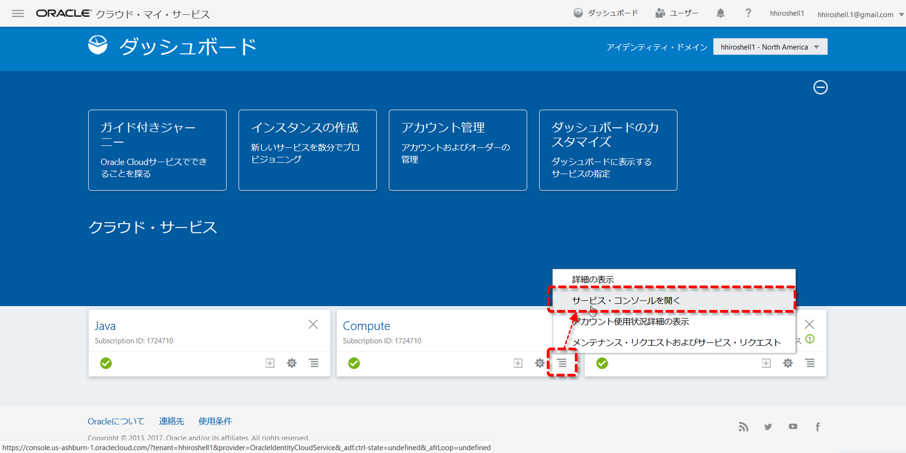

"Compute"パネルが表示されていない場合は、画面上半分の青い領域にある"ダッシューボードのカスタマイズ"をクリックして、"Compute"パネルの表示を有効にしてください。

### 1-2. OCI上に必要なリソースを作成する
OCIのサービス・コンソールを操作して、Compartment等の必要なリソースを作成していきます。

この作業は、最初にOKEを使い始めるときだけ必要な作業です。すでに実施済みの場合は、「2. OKEでKubernetesクラスターをプロビジョニングする」に進んでください。

#### 1-2-1. Compartmentを作成する
CompartmentはOCIのテナントの内部を仕切る区画で、その中に各種リソースを配置したり、CompartmentにPolicyを割り当てることを通じてアカウントの権限を管理したりすることができます。 
ここでは、Kubernetesクラスターとそれを構成するための各種リソースを配置するCompartmentを作成します。

はじめに、OCIのサービス・コンソールの右上のタブで、"Identity"をクリックします。

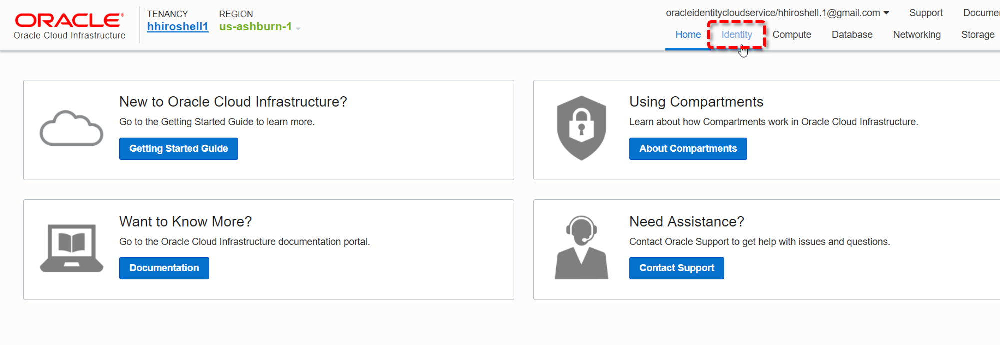

画面左のメニューで"Compartment"をクリックし、更に"Create Compartment"ボタンをクリックします。

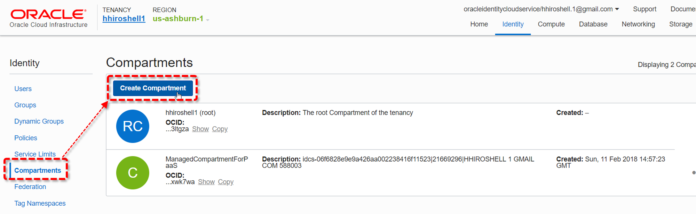

"Create Compartment"ダイアログで以下のように値を設定し、"Create Compartment"ボタンをクリックします。

- NAME: acme-dev-compartment
- DESCRIPTION: acme development environment
- （上記以外はデフォルトのまま）

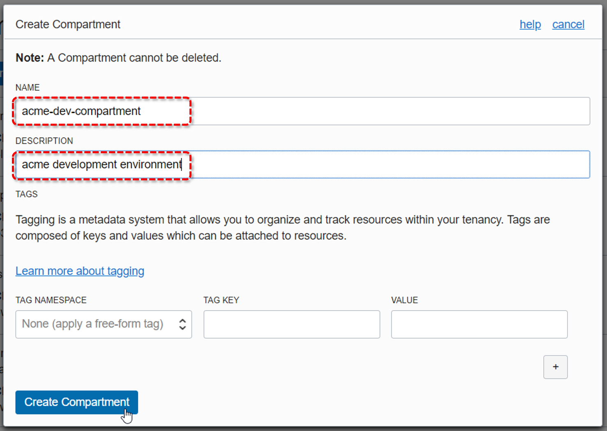

以上で、Compartmentの作成は完了です。

#### 1-2-2. OKEクラスター用のネットワークリソースを作成する
ここでは、Kubernetesクラスターを構築するための、Virtual Cloud Network(VCN)や、Subnetなどのネットワークリソースを作成していきます。

まずはVCNの作成です。はじめにOCIのサービス・コンソールの右上のタブで、"Networking"をクリックします。

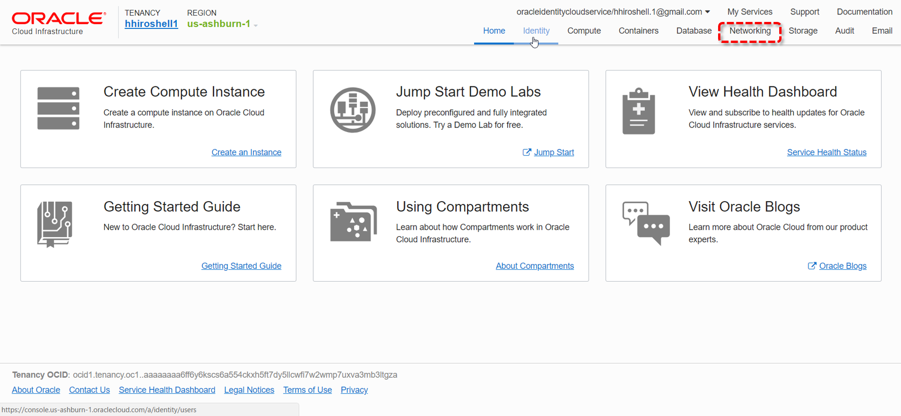

画面左のメニューで"Virtual Cloud Networks"をクリックし、"List Scope"以下のプルダウンで、先に作成した"acme-dev-compartment"を選択します。 
更に"Create Compartment"ボタンをクリックして、VCNの作成を開始します。

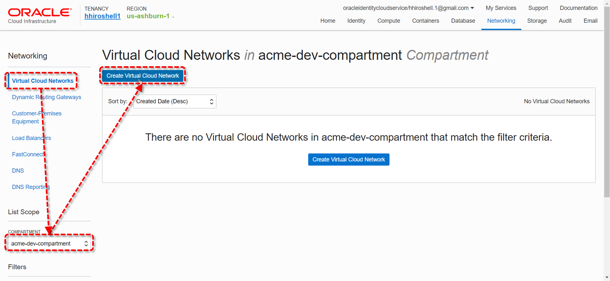

"Create Virtual Cloud Network"ダイアログで以下のように値を設定し、"Create Virtual Cloud Network"ボタンをクリックします。

- CREATE IN COMPARTMENT: acme-dev-compartment
- NAME: acme-dev-vcn
- CREATE VIRTUAL CLOUD NETWORK ONLY: ON
- CIDR BLOCK: 10.0.0.0/16
- （上記以外はデフォルトのまま）

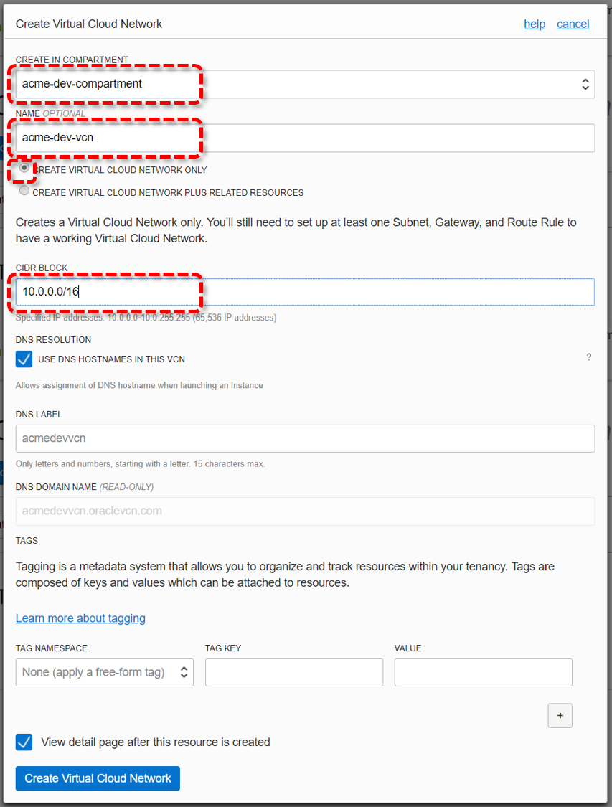

これでVCNの作成は完了です。続いて、VCNの中にインターネットとのアクセスの口になる、Internet Gatewayを作成します。

VCN作成後の画面で、画面左のメニューの"Internet Gateways"をクリックします。"List Scope"以下のプルダウンで"acme-dev-compartment"が選択されていることを確認した上で、"Create Internet Gateway"ボタンをクリックします。

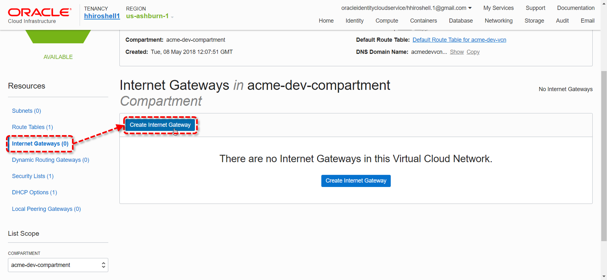

"Create Internet Gateway"ダイアログで以下のように値を設定し、"Create Internet Gateway"ボタンをクリックします。

- CREATE IN COMPARTMENT: acme-dev-compartment
- NAME: gateway-0
- （上記以外はデフォルトのまま）

次に、このGatewayにトラフィックを流すためのRoute Ruleを作成します。

Internet Gateway作成後の画面で、画面左のメニューの"Route Tables"をクリックします。"List Scope"以下のプルダウンで"acme-dev-compartment"が選択されていることを確認した上で、"Create Route Table"ボタンをクリックします。

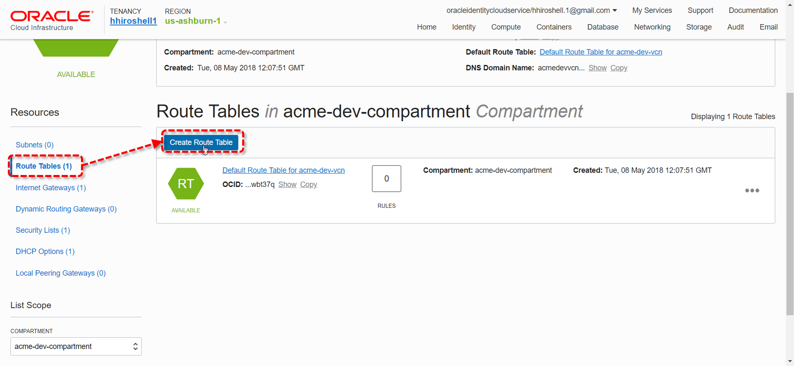

"Create Route Table"ダイアログで以下のように値を設定し、"Create Route Table"ボタンをクリックします。

- CREATE IN COMPARTMENT: acme-dev-compartment
- NAME: routetable-0
- Route Rules（以下のエントリを追加）: 
    * TARGET TYPE: Internet Gateway
    * DESTINATION CIDR BLOCK: 0.0.0.0/0
    * COMPARTMENT: acme-dev-compartment
    * TARGET INTERNET GATEWAY: gateway-0

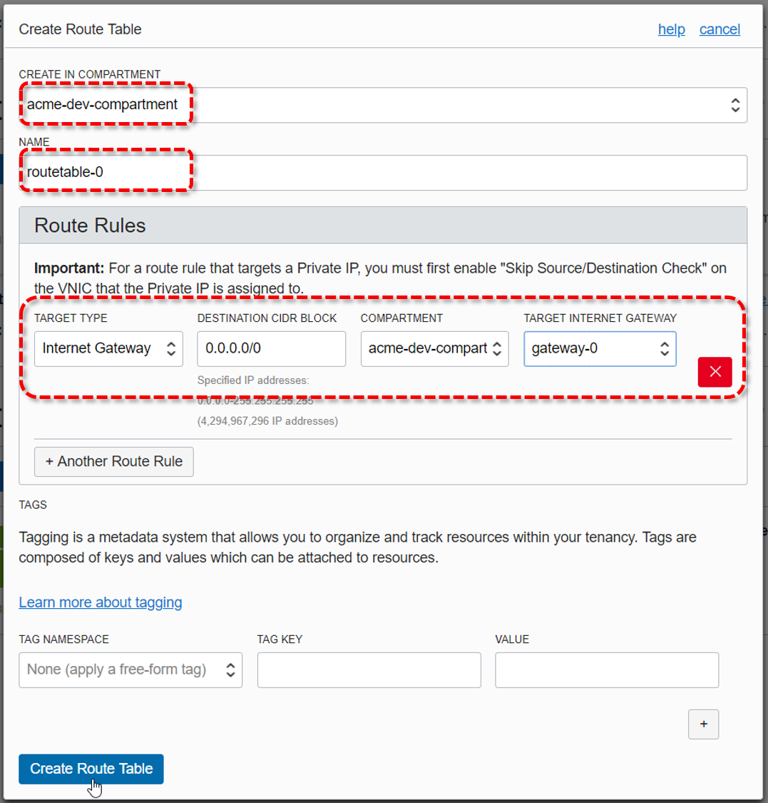

Kubernetesクラスターとインターネットとは、OCIのロードバランサーを介してトラフィックをやり取りします。ここで、ロードバランサーにトラフィックを流す際に、それを許可する条件を定義するRoute Ruleを作成します。

Route Table作成後の画面で、画面左のメニューの"Security Lists"をクリックします。"List Scope"以下のプルダウンで"acme-dev-compartment"が選択されていることを確認した上で、"Create Security List"ボタンをクリックします。

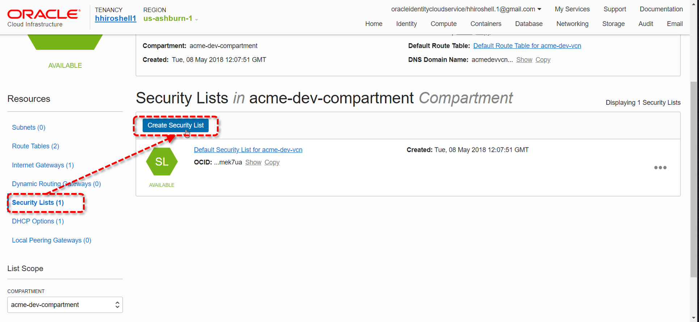

"Create Security List"ダイアログで以下のように値を設定し、"Create Security List"ボタンをクリックします。

- CREATE IN COMPARTMENT: acme-dev-compartment
- NAME: loadbarancers
- Allow Rules for Ingress（以下のエントリを追加）: 
    * Internet Gatewayから流入するトラフィック: 
        * STATELESS: [ON]
        * SOURCE CIDR: 0.0.0.0/0
        * IP PROTOCOL: TCP
        * SOURCE PORT RANGE: All
        * DESTINATION PORT RANGE: All
- Allow Rules for Egress（以下のエントリを追加）: 
    * Internet Gatewayに搬出するトラフィック: 
        * STATELESS: [ON]
        * SOURCE CIDR: 0.0.0.0/0
        * IP PROTOCOL: TCP
        * SOURCE PORT RANGE: All
        * DESTINATION PORT RANGE: All

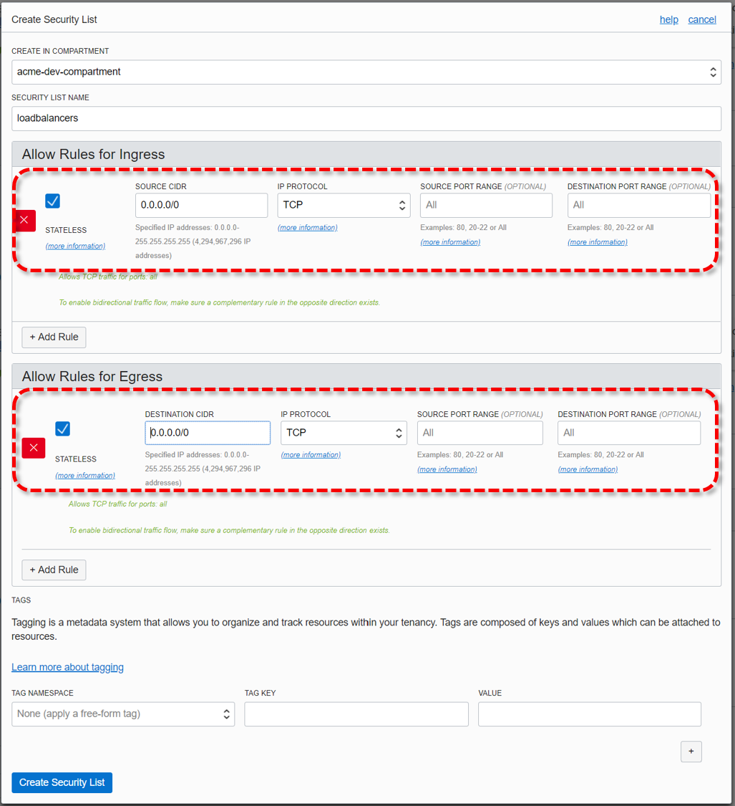

続けて、KubernetesのWorker Nodeにトラフィックを流す際に、それを許可する条件を定義するRoute Ruleを作成します。

前述のRoute Rule作成後の画面で、再度"Create Security List"ボタンをクリックします。

"Create Security List"ダイアログで以下のように値を設定し、"Create Security List"ボタンをクリックします。

- CREATE IN COMPARTMENT: acme-dev-compartment
- NAME: workers
- Allow Rules for Ingress（以下の6つのエントリを追加）: 
    * AD1のSubnetから排出するトラフィック: 
        * STATELESS: [ON]
        * SOURCE CIDR: 10.0.10.0/24
        * IP PROTOCOL: All Protocals
    * AD2のSubnetから排出するトラフィック: 
        * STATELESS: [ON]
        * SOURCE CIDR: 10.0.11.0/24
        * IP PROTOCOL: All Protocals
    * AD3のSubnetから排出するトラフィック: 
        * STATELESS: [ON]
        * SOURCE CIDR: 10.0.12.0/24
        * IP PROTOCOL: All Protocals
    * Path MTU Discoveryのフラグメンテーション・メッセージ用: 
        * STATELESS: [OFF]
        * SOURCE CIDR: 0.0.0.0/0
        * IP PROTOCOL: ICMP
        * TYPE AND CODE: 3, 4
    * OKEのサービスからWorker Nodeを管理するためのSSH接続用: 
        * STATELESS: [OFF]
        * SOURCE CIDR: 130.35.0.0/16
        * IP PROTOCOL: TCP
        * SOURCE PORT RANGE: All
        * DESTINATION PORT RANGE: 22
    * OKEのサービスからWorker Nodeを管理するためのSSH接続用: 
        * STATELESS: [OFF]
        * SOURCE CIDR: 138.1.0.0/17
        * IP PROTOCOL: TCP
        * SOURCE PORT RANGE: All
        * DESTINATION PORT RANGE: 22
    * ユーザーからWorker NodeへのSSH接続用（オプション）: 
        * STATELESS: [OFF]
        * SOURCE CIDR: 0.0.0.0/0
        * IP PROTOCOL: TCP
        * SOURCE PORT RANGE: All
        * DESTINATION PORT RANGE: 22
    * NodePortタイプのServiceによる、Nodeへの直接の通信用（オプション）: 
        * STATELESS: [OFF]
        * SOURCE CIDR: 0.0.0.0/0
        * IP PROTOCOL: TCP
        * SOURCE PORT RANGE: All
        * DESTINATION PORT RANGE: 30000-32767
- Allow Rules for Egress（以下の4つのエントリを追加）: 
    * AD1のSubnet宛のトラフィック: 
        * STATELESS: [ON]
        * DESTINATION CIDR: 10.0.10.0/24
        * IP PROTOCOL: All Protocals
    * AD2のSubnet宛のトラフィック: 
        * STATELESS: [ON]
        * DESTINATION CIDR: 10.0.11.0/24
        * IP PROTOCOL: All Protocals
    * AD3のSubnet宛のトラフィック: 
        * STATELESS: [ON]
        * DESTINATION CIDR: 10.0.12.0/24
        * IP PROTOCOL: All Protocals
    * Internetに出るトラフィック: 
        * STATELESS: [OFF]
        * DESTINATION CIDR: 0.0.0.0/0
        * IP PROTOCOL: All Protocals
- （上記以外はデフォルトのまま）

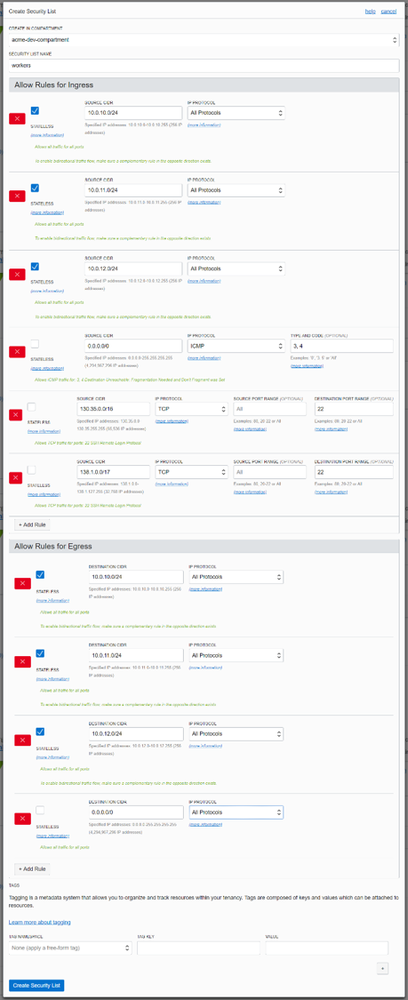

次に、VCN内にロードバランサーを配置するためのSubnetを作成します。OCIのロードバランサーは2つのADに冗長構成で作成されます。AD毎にひとつずつSubnetを用意するため、計2つのSubnetを構成します。

Route Role作成後の画面で、画面左のメニューの"Subnets"をクリックします。"List Scope"以下のプルダウンで"acme-dev-compartment"が選択されていることを確認した上で、"Create Subnet"ボタンをクリックします。

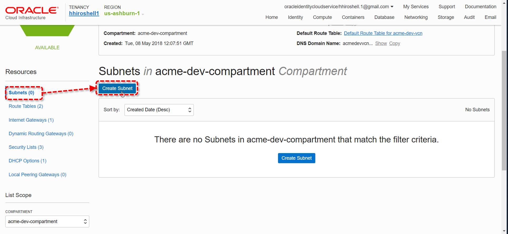

"Create Subnet"ダイアログでSubnetを作成する作業を繰り返して、2つのSubnetを構成します。それぞれのSubnetは、以下の設定値を入力します。

- AD1用
    * NAME: loadbalancers-1
    * AVAILABILITY DOMAIN: [末尾が"AD-1"の項目を選択]
    * CIDR BLOCK: 10.0.20.0/24
    * ROUTE TABLE: routetable-0
    * SUBNET ACCESS: PUBLIC SUBNET
    * DNS RESOLUTION: [ON]
    * DHCP OPTIONS: Default DHCP Options for acme-dev-vcn
    * Security Lists (以下の項目を追加）:
        - loadbalancers
    * （上記以外はデフォルトのまま）
- AD2用
    * NAME: loadbalancers-2
    * AVAILABILITY DOMAIN: [末尾が"AD-2"の項目を選択]
    * CIDR BLOCK: 10.0.21.0/24
    * ROUTE TABLE: routetable-0
    * SUBNET ACCESS: PUBLIC SUBNET
    * DNS RESOLUTION: [ON]
    * DHCP OPTIONS: Default DHCP Options for acme-dev-vcn
    * Security Lists (以下の項目を追加）:
        - loadbalancers
    * （上記以外はデフォルトのまま）

以下の画像は、AD1用の設定例です。

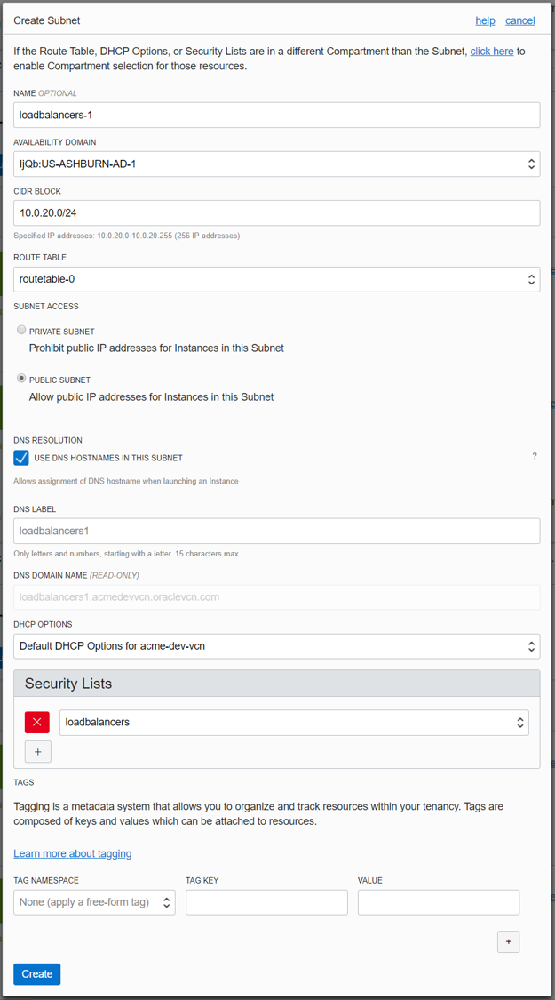

続けて、Worker Nodeを配置するためのSubnetを作成します。Worker Nodeを3つのADに分散配置するには、AD毎にSubnetを用意するため、計3つのSubnetを構成する必要があります。

前述のSubnet作成後の画面で、"Create Subnet"ボタンをクリックします。

"Create Subnet"ダイアログでSubnetを作成する作業を繰り返して、3つのSubnetを構成します。それぞれのSubnetは、以下の設定値を入力します。

- AD1用
    * NAME: workers-1
    * AVAILABILITY DOMAIN: [末尾が"AD-1"の項目を選択]
    * CIDR BLOCK: 10.0.10.0/24
    * ROUTE TABLE: routetable-0
    * SUBNET ACCESS: PUBLIC SUBNET
    * DNS RESOLUTION: [ON]
    * DHCP OPTIONS: Default DHCP Options for acme-dev-vcn
    * Security Lists (以下の項目を追加）:
        - workers
    * （上記以外はデフォルトのまま）
- AD2用
    * NAME: workers-2
    * AVAILABILITY DOMAIN: [末尾が"AD-2"の項目を選択]
    * CIDR BLOCK: 10.0.11.0/24
    * ROUTE TABLE: routetable-0
    * SUBNET ACCESS: PUBLIC SUBNET
    * DNS RESOLUTION: [ON]
    * DHCP OPTIONS: Default DHCP Options for acme-dev-vcn
    * Security Lists (以下の項目を追加）:
        - workers
    * （上記以外はデフォルトのまま）
- AD3用
    * NAME: workers-3
    * AVAILABILITY DOMAIN: [末尾が"AD-1"の項目を選択]
    * CIDR BLOCK: 10.0.12.0/24
    * ROUTE TABLE: routetable-0
    * SUBNET ACCESS: PUBLIC SUBNET
    * DNS RESOLUTION: [ON]
    * DHCP OPTIONS: Default DHCP Options for acme-dev-vcn
    * Security Lists (以下の項目を追加）:
        - workers
    * （上記以外はデフォルトのまま）

以下の画像は、AD1用の設定例です。

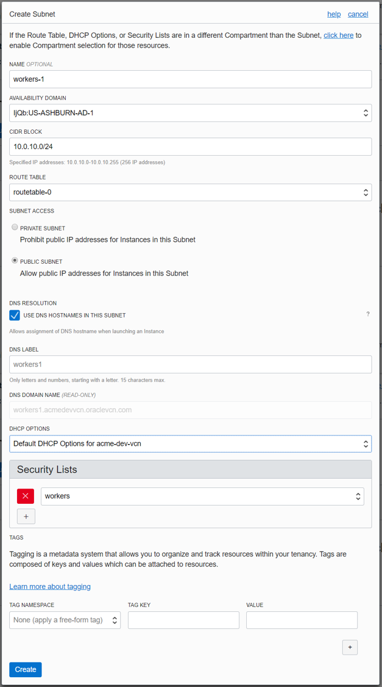

以上で、ネットワークリソースの作成は完了です。

#### 1-2-3. OKEを操作するためのUser/Group/Policyの構成を行う
OKEを利用するには、OKEのサービス自体にOCIのリソースを操作する権限(Policy)を設定するとともに、OKEの機能を利用するためのUser、Groupを作成して適切にPolicyを割り当てる必要があります。

ここではそれらUser/Group/Policyの構成を行います。

まず、OCIのサービス・コンソールの右上のタブで、"Identity"をクリックします。

はじめに、OKEのサービス自体に設定するPolicyを構成します。画面左のメニューの"Policies"をクリックし、"List Scope"以下のプルダウンで"<テナント名> (root)"が選択します。続けて"Create Policy"ボタンをクリックします。

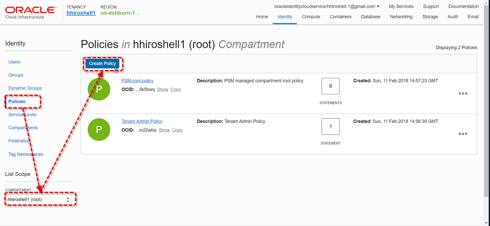

"Create Policy"ダイアログで以下のように値を設定し、"Create"ボタンをクリックします。

- NAME: oke-service
- DESCRIPTION: Allow service OKE to manage all-resources in tenancy
- Policy Versioning: KEEP POLICY CURRENT
- Policy Statements（以下のStatement設定（文字列を入力））:
    * allow service OKE to manage all-resources in tenancy

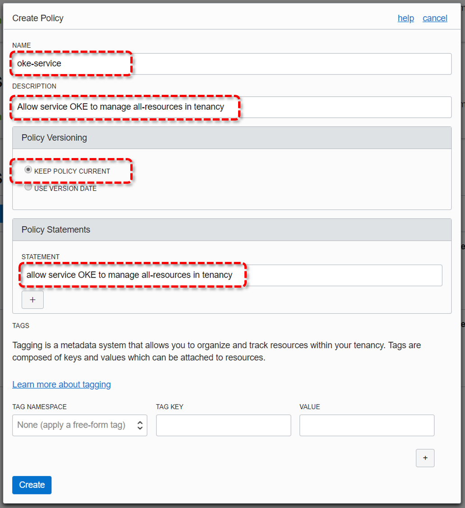

次に、OKEを操作するための権限を割り当てるGroupを作成します。画面左のメニューの"Groups"をクリックし、"Create Group"ボタンをクリックします。

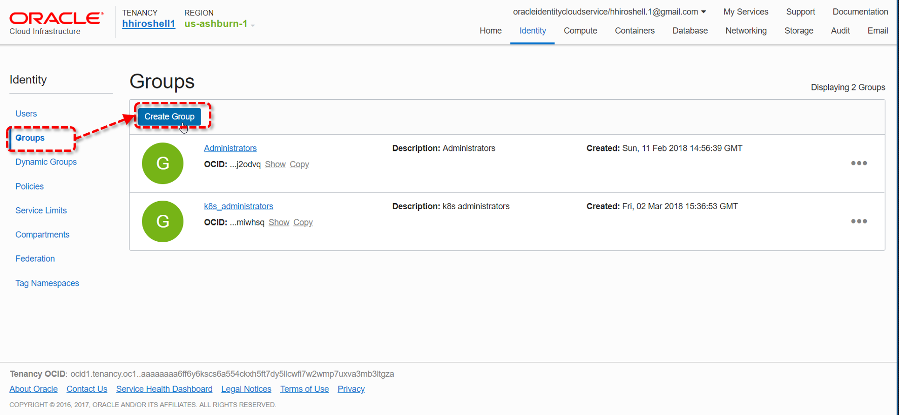

"Create Group"ダイアログでGroupを作成する作業を繰り返して、以下の4つのGroupを作成してください。

- クラスターの管理者:
    * NAME: acme-dev-team
    * DESCRIPTION: acme dev team
- 一般の開発者（クラスターの参照権あり）:
    * NAME: acme-dev-team-cluster-viewers
    * DESCRIPTION: acme dev team cluster viewers
- 一般の開発者（Node Poolの管理権あり）:
    * NAME: acme-dev-team-pool-admins
    * DESCRIPTION: acme dev team pool admins
- 監査者（クラスターに対する操作履歴の参照権あり）:
    * NAME: acme-dev-team-auditors
    * DESCRIPTION: acme dev team auditors

以下の画像は、acme-dev-team作成時の設定例です。

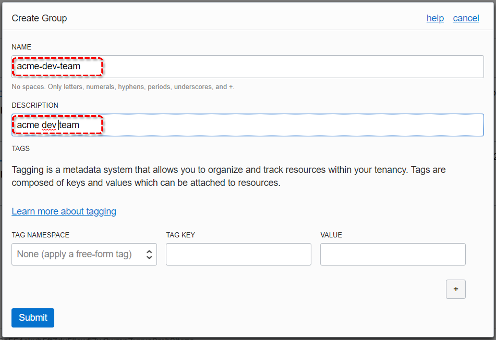

Groupに対する権限の設定（Policyの構成）を行います。画面左のメニューの"Policies"をクリックします。続けて、"List Scope"以下のプルダウンで"<テナント名> (root)"が選択されていることを確認した上で、"Create Policy"ボタンをクリックします。

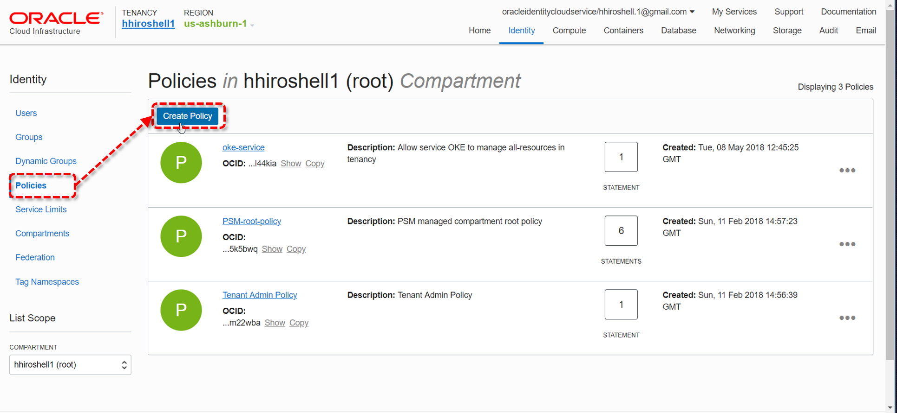

"Create Policy"ダイアログで以下のように値を設定し、"Create"ボタンをクリックします。

- NAME: acme-dev-team-oke-policy
- DESCRIPTION: acme dev team oke policy
- Policy Versioning: KEEP POLICY CURRENT
- Policy Statements（以下のStatement設定（文字列を入力））:
    * allow group acme-dev-team to manage cluster-family in tenancy
    * allow group acme-dev-team to inspect vcns in tenancy
    * allow group acme-dev-team to inspect subnets in tenancy
    * allow group acme-dev-team-cluster-viewers to inspect clusters in tenancy
    * allow group acme-dev-team-pool-admins to use cluster-node-pools in tenancy
    * allow group acme-dev-team-auditors to read cluster-work-requests in tenancy

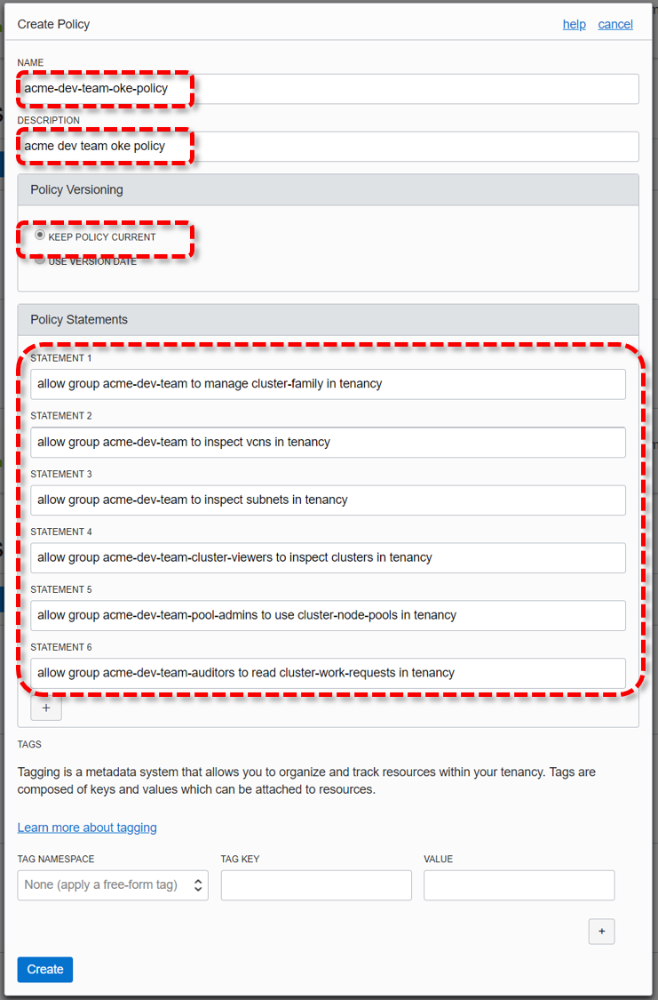

クラスターを操作するためのUserを作成します。ここでは、簡単のため、管理者を想定したUserを作成し、クラスターに対する全ての権限を割り当てます。

画面左のメニューの"Users"をクリックし、続けて"Create User"ボタンをクリックします。

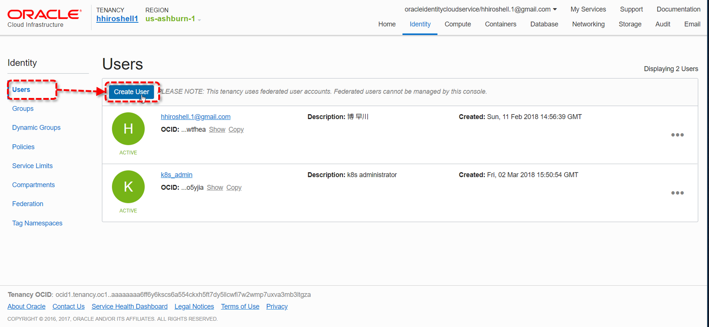

"Create User"ダイアログで以下のように値を設定し、"Create"ボタンをクリックします。

- NAME: acme-dev-admin
- DESCRIPTION: acme development team administrator

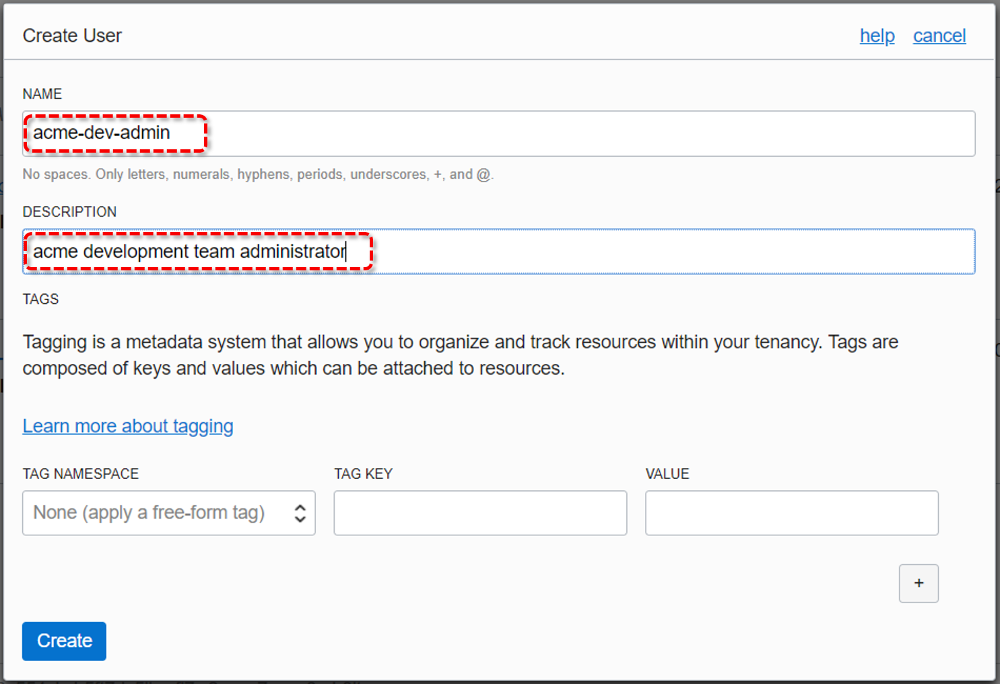

Userの一覧が表示されたら、acme-dev-adminに相当する行のユーザー名をクリックします。

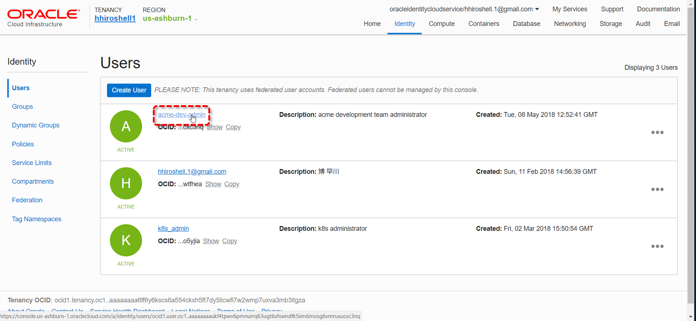

Userの詳細画面の左側にあるメニューで、"Groups"をクリックし、続けて "Add User to Group"ボタンをクリックします。

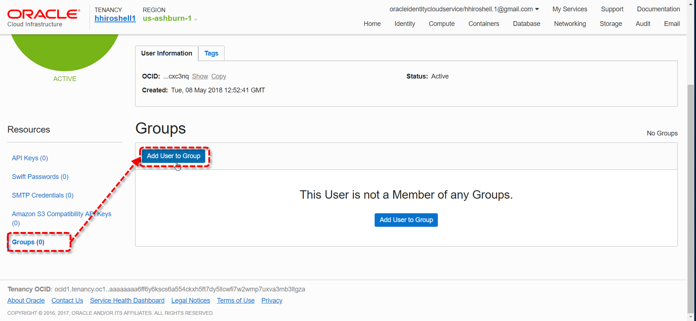

"Add User To Group"ダイアログで、Userを先に作成した4つのグループに追加します。1回のダイアログの操作では1Groupにしか追加できないので、この操作を繰り返す必要があります。

以下は、acme-dev-teamにUserを追加するときの画面例です。

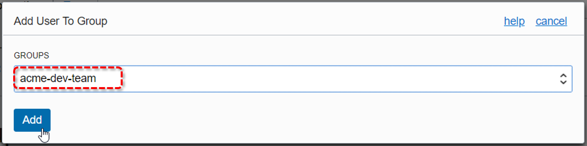

Groupへの追加が完了したら、このacme-dev-adminアカウントにPasswordを設定し、このUserでログインし直します。

まず、acme-dev-adminの詳細画面で、"Create/Reset Password"ボタンをクリックします。

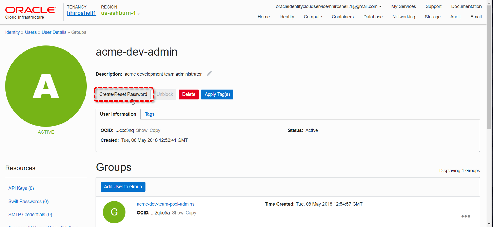

”Create/Reset Password”ダイアログで、"Create/Reset Password"ボタンをクリックします。

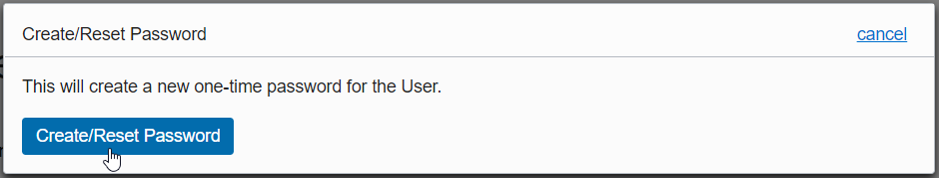

新たなPasswordが表示されたら"Copy"をクリックします。これでPasswordがクリップボードにコピーされます。
続けて"Close"ボタンをクリックしてダイアログを閉じます。

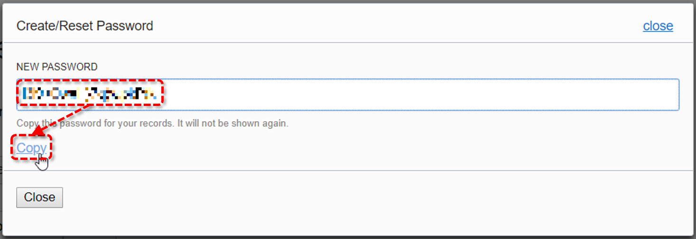

画面右上の、現在ログイン中のユーザー名が表示されている箇所をクリックし、さらに、展開されたメニューの"Sign Out"をクリックします。

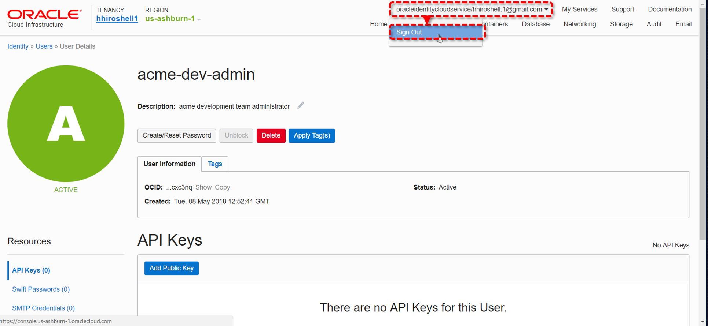

OCIのコンソールのログイン画面が表示されるので、右側にあるUSER NAMEとPASSWORDのフォームを使ってログインします。それぞれ、入力値は以下のとおりです。

- USER NAME: acme-dev-admin
- PASSWORD: [先の手順で作成したPassword（クリップボードからペースト）]

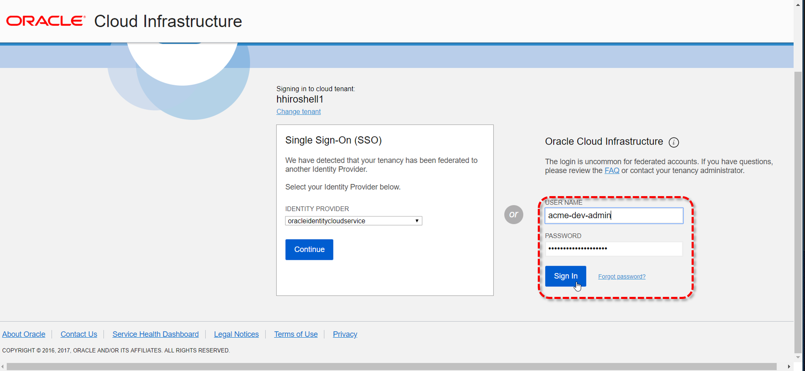

初期パスワードの変更を求められるので、現在のパスワードと新たに設定するパスワードを入力します。

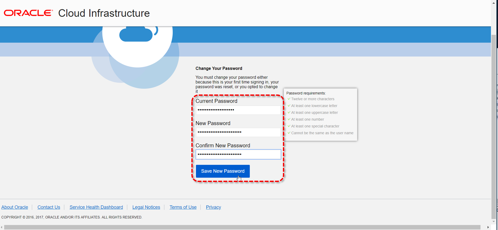

この画面の操作を完了すると、acme-dev-adminでOCIの管理コンソールにログインした状態になります。

以上で、準備作業は完了です。

2 . OKEでKubernetesクラスターをプロビジョニングする
---------------------------------------------------
ここでは、OKEでKubernetesクラスターをプロビジョニングしていきます。

はじめに、OCIのサービス・コンソールの右上のタブで、"Containers"をクリックします。

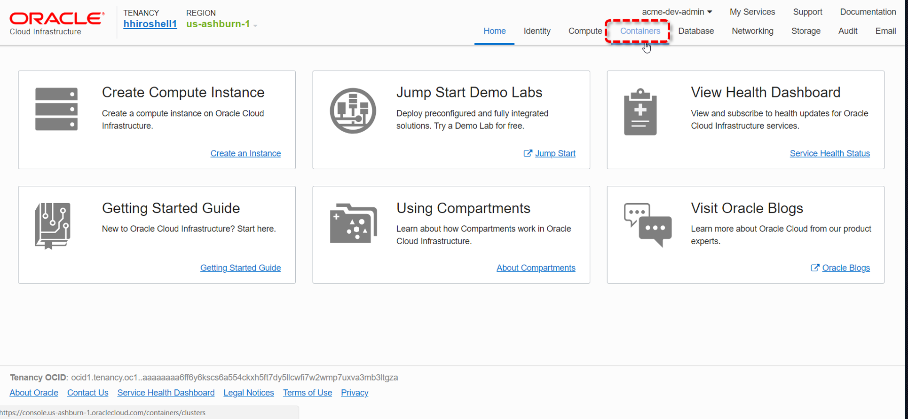

画面左のメニューで"Clusters"をクリックし、List Scpesのメニューで"acme-dev-compartment"を選択します。続けて、"Create Cluster"ボタンをクリックします。

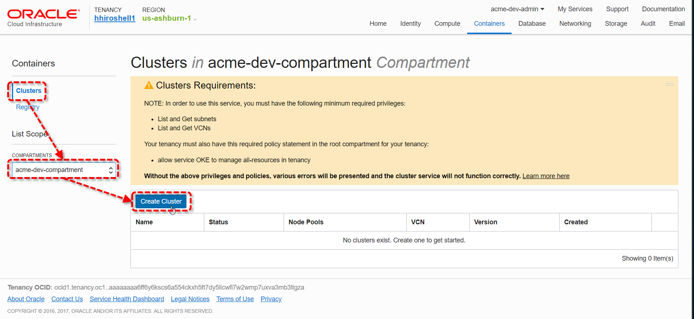

"Create Cluster"ダイアログで以下のように値を設定し、"Add a Node Pool"ボタンをクリックします。

- NAME: my-first-cluster
- VERION: v1.9.7
- VCN: amce-dev-vcn
- KUBERNETES SERVICE LB SUBNETS: loadbalancers-1, Loadbalancers-2
- （上記以外はデフォルトのまま）

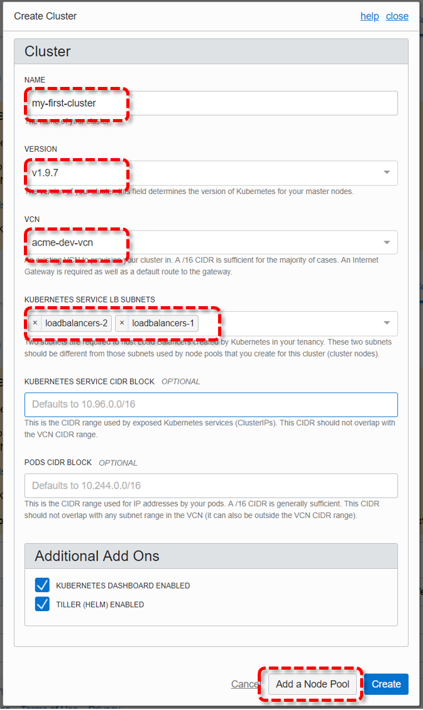

"Node Pool"の設定値の入力フォームが展開されたら、以下のように値を設定し、"Create"ボタンをクリックします。

- NAME: my-first-node-pool
- VERION: v1.9.7
- IMAGE: Oracle-Linux-7.4
- SHAPE: VM.Standard1.1
- SUBNETS: worker-1, worker-2, worker-3
- QUANTITY PER SUBNET: 1

この設定値は、3つの各ADに1つのWorker Nodeを構成しています。

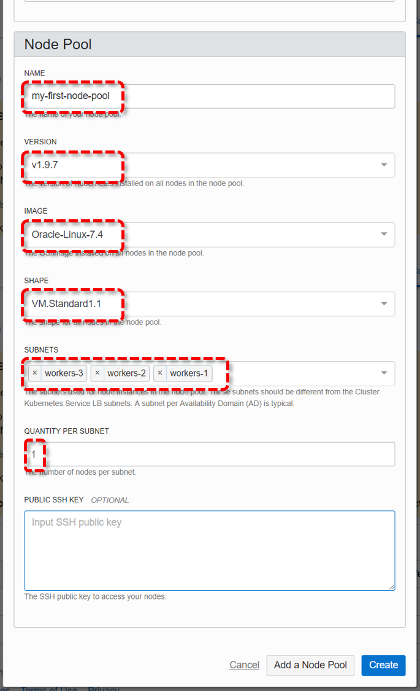

クラスターの一覧画面に、my-first-clusterが表示されます。StatusがRunningになったら、プロビジョニングは完了です（おおむね数分程度で完了します）。

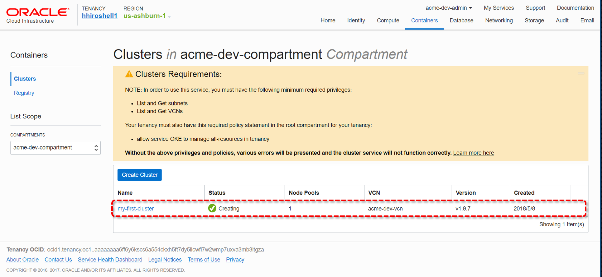

3 . Kubernetesの管理用CLI(kubectl)をセットアップする
----------------------------------------------------
ここまでの手順でプロビジョニングしたKubernetesクラスターに対して、Kubernetesの管理用CLI(kubectl)を使ってアクセスしてみます。

OKEクラスターへのアクセスに必要なkubectlの設定情報を得るには、予めOCIのCLIをインストールしておく必要があります。また、OCI CLIをインストールするために、Pythonの2.7.5以上 または 3.5以上が必要です。

ここでは、kubectl, Python, OCI CLIをインストールした後、kubectlでOKEクラスターにアクセスするまでの手順を記します。

### 3-1. kubectlとPythonのインストール

#### 3-1-1. kubectlのインストール
[Kubernetesの公式ドキュメントの手順](https://kubernetes.io/docs/tasks/tools/install-kubectl/)に従って、kubectlをインストールしておきます。

#### 3-1-2. Pythonのインストール
OKEクラスターへのアクセスに必要なkubectlの設定情報を得るには、予めOCI CLIをインストールしておく必要があります。

OCI CLIをインストールするには、Pythonの2.7.5以上 または 3.5以上がインストールされている必要があります。Pythonのバージョンを確認するには、ターミナルで以下のコマンドを実行します。

Python 2.x 系の場合

    python --version

Python 3.x 系の場合

    python3 --version

もし上述の条件を満たしていない場合は、ここでPythonのインストール／アップデートを行ってください。

### 3-2. Oracle Cloud InfrastructureのCLIをセットアップする
ここでは、OCI CLIのインストールを行います。

#### 3-2-1. OCIDの確認
acme-dev-adminアカウントでOCIのコンソールにログインし、画面右上の現在ログイン中のユーザー名が表示されている箇所をクリックします。さらに、展開されたメニューの"User Settings"をクリックします。

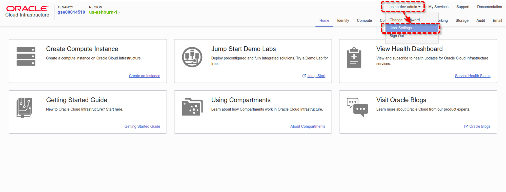

ユーザーの詳細情報の画面で”User Information"タブ内にユーザーのOCIDが表示されている箇所があります。OCIDの値の右にある"Copy"をクリックすると、クリップボードにOCIDがコピーされるので、これを手元のテキストエディタなどにペーストしておきます。

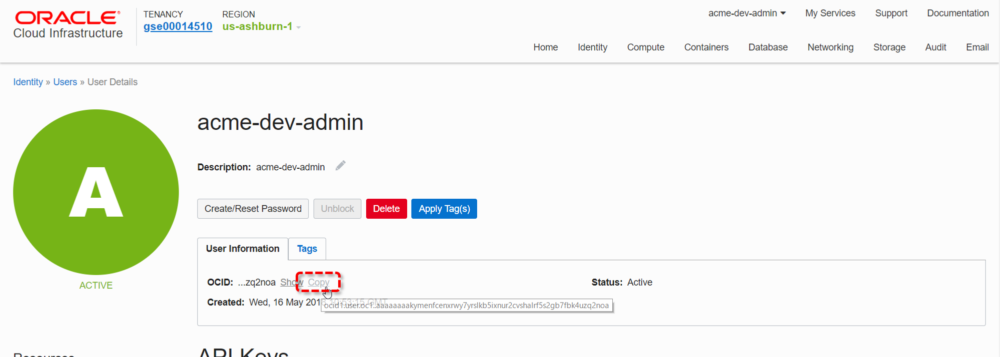

次に、コンソール上部の TENANCY の下のテナント名のリンクをクリックします

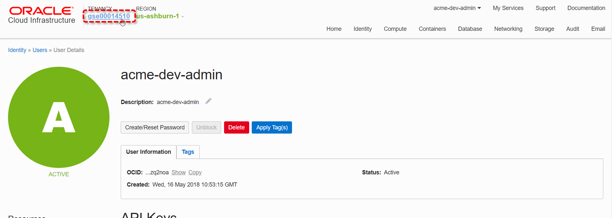

Tenantの詳細情報の画面で”Tenancy Information"タブ内にOCIDが表示されている箇所があります。OCIDの値の右にある"Copy"をクリックすると、クリップボードにOCIDがコピーされるので、これを手元のテキストエディタなどにペーストしておきます。

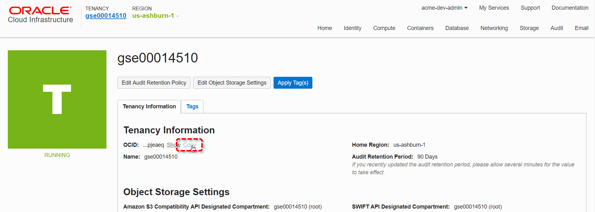

#### 3-2-2. OCI CLIのセットアップ
OCI CLIをインストールするには、以下のコマンドを実行します。

    bash -c "$(curl -L https://raw.githubusercontent.com/oracle/oci-cli/master/scripts/install/install.sh)"

CLIのバイナリの配置先などを設定するインタラクションがあります。自身の環境に合わせて、好みの設定を行ってください（全てデフォルトのままで進めても問題ありません）。

インストールが完了したら、OCI CLIの初期セットアップを行います。以下のコマンドを実行してください。

    oci setup config

ここでも設定をおこなうためのインタラクションがあります。ここでは、以下のように入力してください。この例では、インタラクションの途中でAPIキーを生成しますが、もし別途用意していあるAPIキーを使用する場合は Do you want to generate a new RSA key pair? という質問にNと答えてください。

- Enter a location for your config [/home/<ユーザー名\>/.oci/config]: 入力なしでENTERキーを押す
- Enter a user OCID: - 先の手順で確認したユーザーのOCIDを入力
- Enter a tenancy OCID: - 先の手順で確認したテナントのOCIDを入力
- Enter a region (e.g. eu-frankfurt-1, us-ashburn-1, us-phoenix-1): アクセスしたいリージョンを例に従って入力
- Do you want to generate a new RSA key pair? (If you decline you will be asked to supply the path to an existing key.) [Y/n]: - Y
- Enter a directory for your keys to be created [/home/<ユーザー名\>/.oci]: - 入力なしでENTERキーを押す
- Enter a name for your key [oci\_api\_key]: - 入力なしでENTERキーを押す
- Enter a passphrase for your private key (empty for no passphrase): - 任意のパスフレーズを入力

CLIからOCIに対してアクセスを行う際には、OCIのAPIの認証が行われます。このため予め認証をパスするのに必要なAPIキーを、ユーザー毎にOCIにアップロードしておく必要があります。

OCI CLIの初期セットアップの際に作成した鍵ペアのうち、公開鍵の方を、管理コンソールからアップロードします。

まず、以下のターミナルで以下のコマンドを実行し、公開鍵を表示しておきます。

    cat ~/.oci/oci_api_key_public.pem

続いてOCIのコンソールに移り、画面右上の現在ログイン中のユーザー名が表示されている箇所をクリックします。さらに、展開されたメニューの"User Settings"をクリックします。

ユーザーの詳細画面の左側のメニューで、"API Keys"をクリックし、さらに"Add Public Key"ボタンをクリックします。

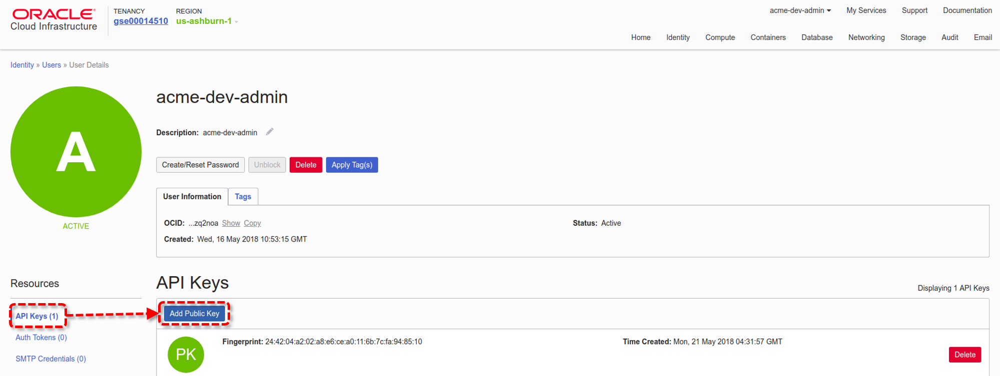

”Add Public Key"ダイアログの入力欄に、先ほとターミナルに表示した公開鍵をペーストし、"Add"ボタンをクリックします（"-----BEGIN PUBLIC KEY-----"と"-----END PUBLIC KEY-----"の行も含めてペーストします）。

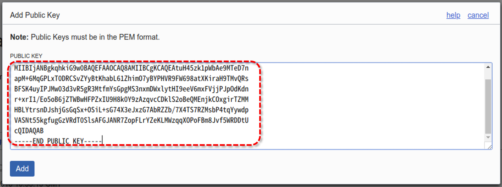

以上でOCI CLIのセットアップは完了です。

### 3-3. kubectlの設定を行って、クラスターにアクセスする
最後にkubectlの設定ファイルを取得し、kubectlで実際にクラスターにアクセスしてみます。
OCIのコンソールで、画面右上のタブから"Containers"をクリックします。

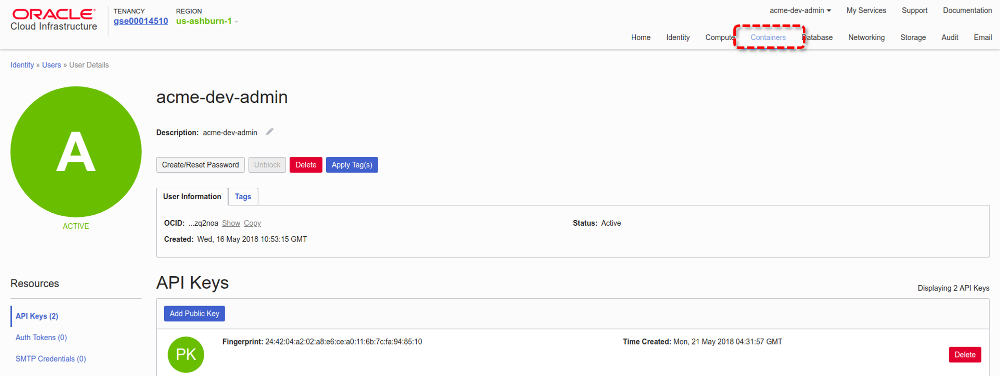

先の手順で作成しておいた"my-first-cluster"の名前をクリックします。

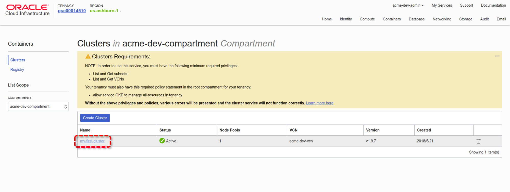

クラスターの詳細画面で、"Access Kubeconfig"をクリックします。

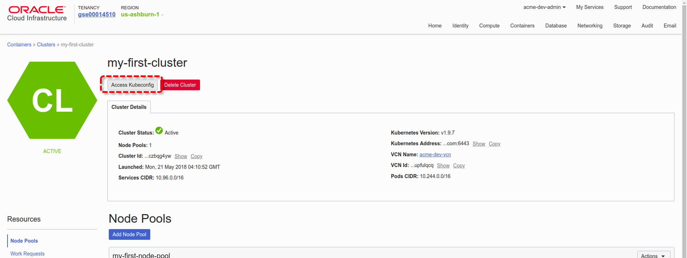

”How to Access Kubeconfig”ダイアログの"Download script"ボタンをクリックします。

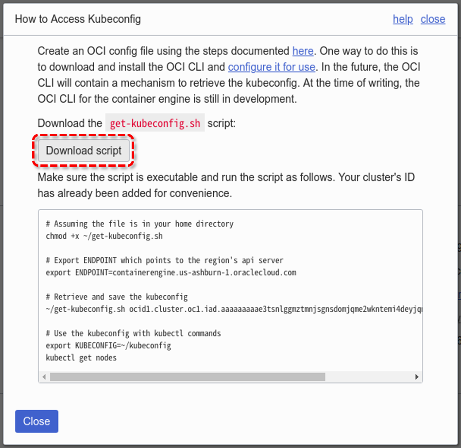

"get-kubeconfig.sh"という名前の、kubectlの設定ファイルを取得するためのスクリプトがダウンロードされますので、これをhomeディレクトリに移動しておきます。

    cd ~/
    mv ~/Downloads/get-kubeconfig.sh ~/

続いて、”How to Access Kubeconfig”ダイアログのテキストボックス中に表示されているコマンドを順次実行していきます。
最後に実行する``kubectl get nodes``により、kubectlでクラスターにアクセスしています。以下のような実行結果になれば、正常にクラスターにアクセスできています。

    NAME              STATUS    ROLES     AGE       VERSION
    129.213.100.157   Ready     node      3d        v1.9.7
    129.213.118.118   Ready     node      3d        v1.9.7
    129.213.95.69     Ready     node      3d        v1.9.7

以上で、OKEでKubernetesクラスターをプロビジョニングし、利用を開始するまでの手順は完了です。

